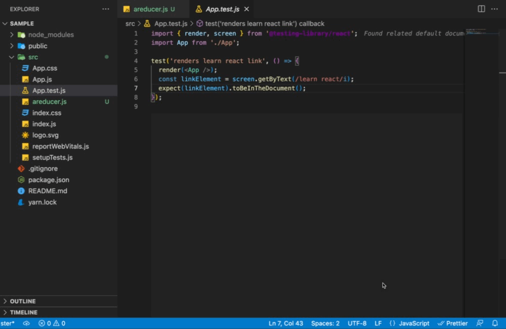

# Sensible Front End Defaults extension for Visual Studio Code

This [Visual Studio Code](https://code.visualstudio.com/) (VS Code) extension provides the Thoughtworker with the ability to get the related default documents which exhibits Thoughtworks best practices which are also known as signals. The features includes detection of certain signals that can be or is incorporated in the current code base, navigation to the related default document.This way, Thoughtworkers can make sure that they are aware of such best practices.

# Getting started

Inorder to get started with the extension,

1. Install the extension from within VS Code, or download it from the marketplace. Please make sure that you have VS Code of version **1.69.2** or above in order for this extension to work.
2. Open any of the project which is written in either of the following languages:
   - javascript
   - typescript
3. Now, the extension would be active and should provide the user with suggestions when it detects a scope for providing one of the best practices.

# Usage

Open any front end project which uses any of the following languages:

- javascript
- typescript
  now, the extension would highlight the words for which there's a signal associated with it.

Inorder to view much details about the signals associated with the highlighted text, hover over the text. Clicking on the **here** in the details section where is says to take to the document would open the document in the browser.

For ignoring a particular signal, click on the **here** in the details section where is says to ignore.

The extension would also show an information section when we navigate to a file which is a part of the signal.

